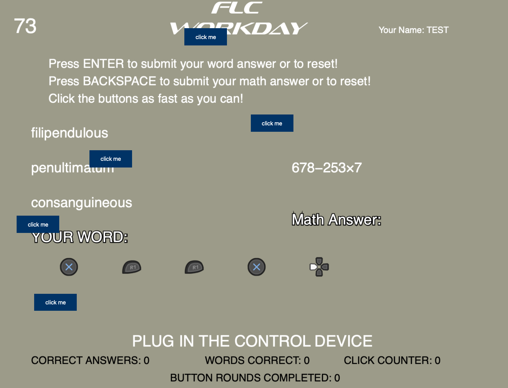

# FLC Workspace

FLC Workspace is a game built as the final project for Interaction Design Studio at the IDM program, [NYU Tandon School of Engineering.](https://idm.engineering.nyu.edu)

  <kbd>
    
  </kbd>

## Description

I designed a game and installation based around the idea of “bullsh*t jobs” for a final class project. The initial inspiration came from wanting to design a game that is inherently annoying to play. This evolved into ideation around the nature of work and play in general, and the discourse over laptop jobs/white collar work in the modern era.

For the installation, I built out a small messy office workers desk and asked a volunteer to play as my employee while I as an overbearing boss, guided them through a day of work via the game.

Please visit [Lousansano.com](https://lousansano.com) for photos of the installation and additonal game screenshots.

### Please note!

The gamepad stage and final will need a Sony Dualshock 4 or Dualsense controller to play!

### Built with

- p5.js
- JavaScript

## Acknowledgements

Camila Morales and Tim O’Keefe for their assistance and guidance with this project. Tate Gregor for co-producing music and sound effects.